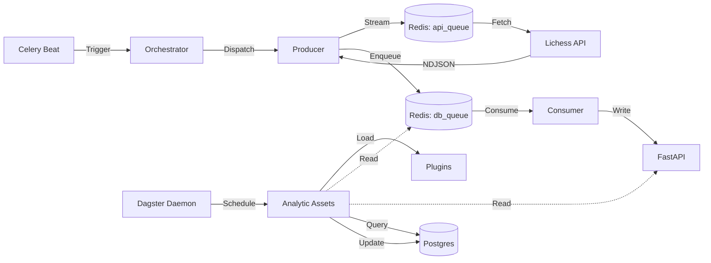

# Personal Backend: Chess Data Pipeline

A robust, scalable data engineering platform designed to ingest, store, and analyze chess match data from Lichess.

## 🚀 Overview

This project implements a **Producer-Consumer** architecture to efficiently fetch game data while strictly adhering to external API rate limits. It uses **FastAPI** for the backend interface and **Celery** with **Redis** for asynchronous task processing.

### Key Features
- **Strict Rate-Limiting**: Uses a **Global Redis Lock** to ensure **no concurrent requests are made** to the Lichess API.
- **Parallel Processing**: Scalable consumer workers process and store games in parallel.
- **Plugin-Based Analysis**: Modular analysis system allowing easy addition of new metrics (e.g., "Largest Swing").
- **Graph Traversal**: Automatically discovers and fetches games for opponents to build a network of players.
- **Resumable & Idempotent**: Smart cursors ensure data collection resumes exactly where it left off.

## 🏗️ Architecture

The system is split into specialized workers to handle different types of workloads efficiently.

### 1. Ingestion (Fetching)
- **Producer (`celery_producer`)**:
  - **Single Concurrency**: Runs serially to respect Lichess API limits.
  - **Streaming**: Streams games via NDJSON and dispatches them immediately.
- **Consumer (`celery_consumer`)**:
  - **High Concurrency**: Processes raw game data in parallel and writes to the DB.

### 2. Analysis (Plugins)
- **Shared Library (`common/analytics`)**:
  - Contains reusable analysis logic and plugins.
  - **Plugins**: Modular classes (subclassing `BaseAnalytic`) that perform specific calculations (e.g., "Move Count", "Eval Swing").
- **Orchestration (Dagster)**:
  - **Dynamic Assets**: Dagster automatically scans `common/analytics/plugins/` and creates assets for each analytic.
  - **Batch Processing**: Efficiently finds games pending analysis (using "Left Join" strategy) and processes them in batches.



## 📦 Services

| Service | Role | Description |
|---------|------|-------------|
| `fastapi` | API / Data Layer | Central REST API and database interface. |
| `celery_producer` | Ingestion | Fetches data from Lichess. **Global Lock ensures serial execution**. |
| `celery_consumer` | Processing | Processes raw data and writes to DB. **Concurrency: 8**. |
| `dagster_webserver`| Orchestration UI | User interface for managing and viewing analytics runs. |
| `dagster_daemon` | Orchestrator | Runs scheduled runs and sensors for analytics assets. |
| `celery_beat` | Scheduler | Triggers periodic tasks. |
| `redis` | Broker | Message broker for Celery queues. |
| `postgres` | Database | Persistent storage. |

## ⚡ Quick Start

### Prerequisites
- Docker & Docker Compose
- Lichess API Token

### 1. Clone & Configure
```bash
git clone <repository-url>
cd personal-backend
# Create .env file (see .env.example or docs)
```

### 2. Run with Docker
```bash
docker-compose up --build -d
```

### 3. Verify
```bash
docker-compose logs -f celery_producer dagster_daemon
```

## 🧪 Development

### Local Setup (Python)
```bash
# Install dependencies
cd celery
pip install -r requirements.txt

# Run Tests (Dockerized)
make test
```

### CI/CD & Release Management
- **GitHub Actions**: Tests run on every PR.
- **Release Please**: Automates versioning, changelogs, and GitHub Releases.
- **Conventional Commits**: We strictly follow the [Conventional Commits](https://www.conventionalcommits.org/) specification. This is **required** for Release Please to work correctly.
  - `feat:` for new features (triggers minor version bump)
  - `fix:` for bug fixes (triggers patch version bump)
  - `chore:`, `docs:`, `refactor:` for other changes (no version bump unless specified)

## 📂 Project Structure

```
.
├── AGENTS.md           # Detailed Architecture Documentation
├── celery/             # Celery Workers
│   ├── celery_app.py   # App Entry Point & Schedule
│   └── tasks/          # Task Modules
├── common/             # Shared Library
│   ├── analytics/      # Analysis Logic & Plugins
│   │   ├── base.py     # Abstract Base Classes
│   │   └── plugins/    # Pluggable Analysis Metrics
│   └── models.py       # Database Schema
├── fastapi/            # Backend API
├── orchestration/      # Dagster Orchestration
│   ├── assets/         # Dynamic Analytic Assets
│   └── repository.py   # Dagster Repository
└── docker-compose.yml  # Infrastructure Definition
```
